# Deploying an Instance

## Getting Started

### Pre-requisites

- Amazon Web Services Account
- Amazon EC2 Console Account

### Free Trial

EMS offers a 30-day free trial use for first-time customers.

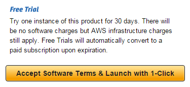

**Note:** There will be no software changes but the AWS infrastructure charges still apply.

## Deployment

To get started with the EvoStream Media Server (EMS) on Amazon EC2 you will first need to purchase an EMS instance through the Amazon Web Services [website](https://aws.amazon.com/marketplace).

1. Search for the EvoStream Media Server in the AWS marketplace, or simply follow this [link](https://aws.amazon.com/marketplace/pp/B00VTR946Y).

   

2. Click **Continue** and **Sign in** your AWS account

   

   ​

3. Select what type of EMS instance you will run: *(1-Click Launch or Manual Launch)*

- ### **1-Click Launch**

  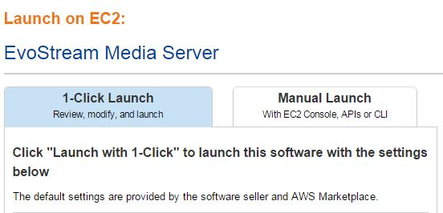

  The setup for the instance is made easy by the Amazon 1-click Launch utility and the EMS can be successfully deployed with all of the default settings.

  A.	Select the **Version** of the EMS to be used

  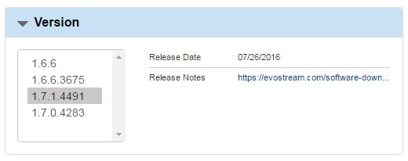

  B.	Select the **Region** and **EC2 Instance Type** (size of computer) for your deployment

  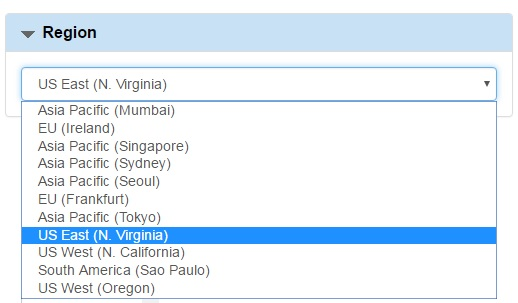

  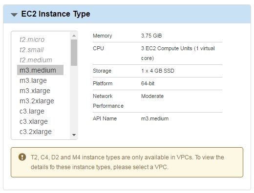

  ​

  **Note:** The EMS can be run on very small computers, including Micro EC2 instances. The size of the instance should be a direct reflection of how much sustained traffic you expect to be hosting. In almost all scenarios you will run out of bandwidth prior to exhausting the CPU or memory limits of the virtual machine.

  ​

  C.	Select or create the **VPC** and **Subnet** to be used.

  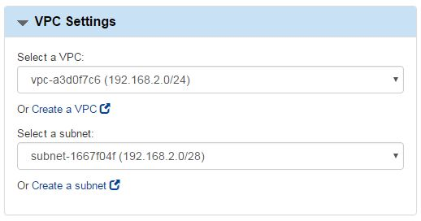

  **Note:** See Amazon documentation on [VPC](http://docs.aws.amazon.com/AmazonVPC/latest/UserGuide/VPC_Introduction.html) for more information.

  ​

  D.	Choose a **Security Group**

  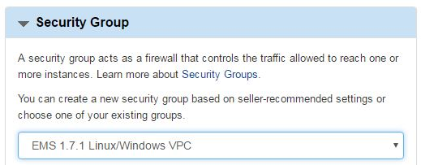

  The default security group has been designed to provide outside access to all ports used for streaming. The ports are defined and used as follows:

| **Port** | **Use**                             |
| -------- | ----------------------------------- |
| 1112     | Telnet for API (JSON)               |
| 1113     | (Internal use only)                 |
| 1222     | Telnet for API (ASCII)              |
| 1935     | RTMP                                |
| 1936     | (Internal use only)                 |
| 22       | SSH                                 |
| 3389     | RDP                                 |
| 4443     | RTMP                                |
| 5000     | (Reserved)                          |
| 5544     | RTSP                                |
| 5985     | (Reserved)                          |
| 6666     | Live FLV                            |
| 7777     | HTTP for API                        |
| 8080     | HTTP Requests                       |
| 8100     | JSON META                           |
| 8210     | WS JSON META                        |
| 8410     | WS FMP4                             |
| 8888     | HTTP for EWS (EvoStream Web Server) |
| 9999     | MPEG TS                             |

These Security Settings can be changed but it will impact the accessibility of the streams on your server.

**Note:** See Amazon documentation on [Security Group](https://docs.aws.amazon.com/AWSEC2/latest/UserGuide/using-network-security.html#default-security-group) for more information.

E.	Choose or create a **Key Pair**

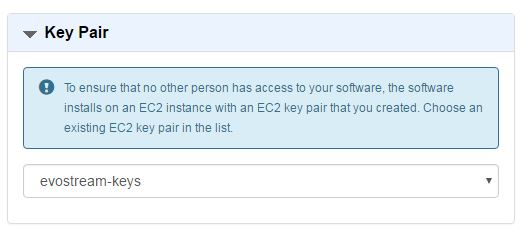

Either choose an existing key pair for instance access or create a new one for your account. If you choose an existing pair you **MUST** have the .pem file already downloaded from that pair. Amazon does not allow you to download key pairs a second time.

**Note:** See Amazon documentation on [Key Pairs](http://docs.aws.amazon.com/AWSEC2/latest/UserGuide/ec2-key-pairs.html) for more information.

F.	Review the settings created, click on **Launch with 1-Click**

- ### **Manual Launch**

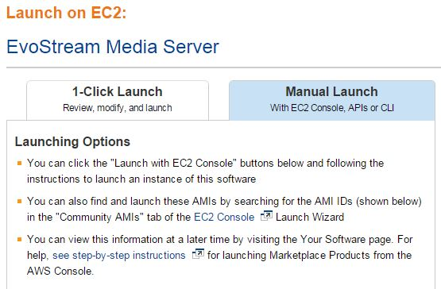

**Step 1: Choose AMI**

A.	Select the **EMS version** to be used

B.	Click the **Launch with EC2 Console** of the chosen **Region**

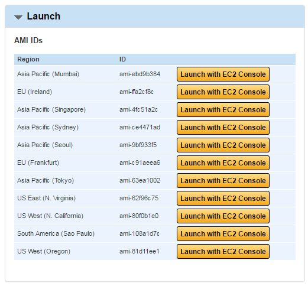

**Step 2: Choose Instance Type**

You will now be redirected to the **Launch Instance Wizard in Step 2**. You may launch or with continue the configuration of the image.

C.	Select the **Instance Type** to be used. You may **Review and Launch** the AMI or click **Next** to continue with the configuration

**Step 3: Configure Instance Details**

D.	Configure the instance to suit your requirements. You may **Review and Launch** the AMI or click **Next** to continue with the configuration

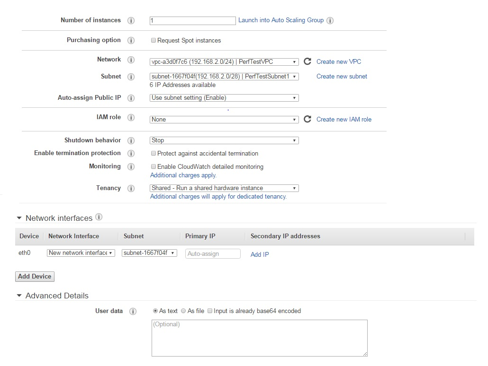

**Step 4: Add Storage**

E.	**Add New Volume** or you may **Review and Launch** the AMI or click **Next** to continue with the configuration

F.	Add a tag for the instance or you may **Review and Launch** the AMI or click **Next** to continue with the configuration

G.	**Create** or **select** the **security group** to be used then click **Review and Launch**

**Step 7: Review and Launch**

H.	Review the configuration made, click **Launch** or go back to modify the changes

I.	A window for the keys will prompt. Select an existing key pair or create or proceed without the key pair to be used. Click **Launch instances**

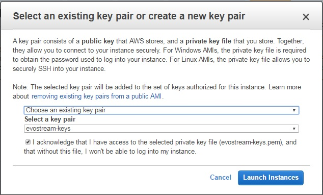

**Note:** You will find the instance created in Instances under **Instances Menu**.