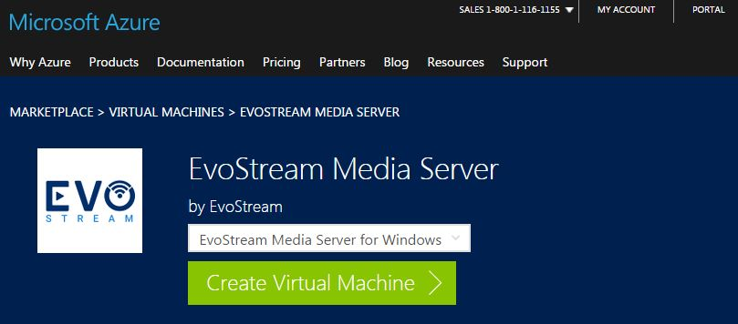
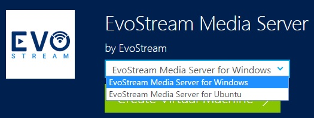
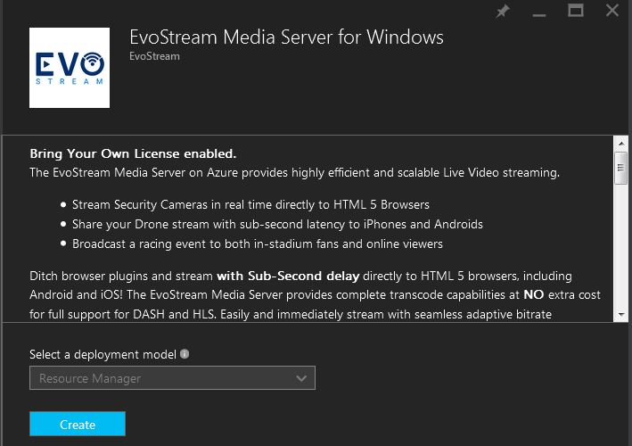

# EMS Load Balancer

## Getting Started

### Pre-requisites

- Microsoft Account

Limitations

## Deployment

To get started with the EvoStream Media Server (EMS) on Azure, the first thing to do is to setup the virtual machine by using the **Quick Deployment** or **Setting up the Virtual Machine** from scratch. 

### A.	Quick Deployment

To lessen the time of configuring a virtual machine, clicking the links below will navigate you to the Custom Deployment Template.

- _Quick-Deploy: Steps 1 and 2 below can be skipped by clicking one of the following buttons:_  
  - _Quick-Deploy EvoStream Media Server 1.7.1 for Windows Server 2012 R2_  
    
  - _Quick-Deploy EvoStream Media Server 1.7.1 for Ubuntu 14.04 64-bit_  
    

**Note:** The size of the machine used in this setup is the A5 Standard.

​	

### B.	Setup Virtual Machine Environment

1. Search for the EvoStream Media Server in the Azure marketplace, or simply follow this [link](https://azure.microsoft.com/en-us/marketplace/partners/evostream-inc/evostream-media-server/).

   

   ​

2. Select the operating system for the virtual machine to be created. Click on **Create Virtual Machine** button.

   

   ​

   **Images available:**

   - EvoStream Media Server for Windows - Windows Server 2012 R2
   - EvoStream Media Server for Ubuntu - Ubuntu 14.04 64-bit

   ​

3. **Sign in** your Microsoft Azure account if not yet signed in. You will be redirected to the EvoStream Media Server page.  Read on the notes and if ready, click on the **Create** button.

   

   ​

4. Configure the virtual machine settings based on your preferences:

   - [x] Configure basic settings

         

- [x] Choose virtual machine size

         **Note:** Click on View all to see all the available machine size

         

- [x] Configure optional features

        

      ​

- [x] Review Summary

        

      ​

- [x] Buy

      

      ​

5. Review the **Settings**, **Offer Details** and **Terms of Use** then click **Purchase** to start the deployment

6. To check if the image has been created, on the **Microsoft Azure Dashboard**, click on the **Virtual machines**. You will now see the image created once the deployment succeeded.

**Note:** The machine is started after the deployment