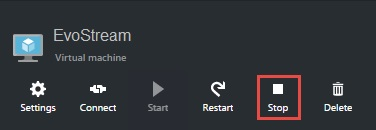
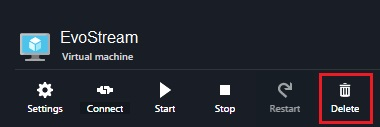

# Terminating EMS on Azure

## Stopping EMS machine

When you want to stop the virtual machine, fret not, all the changes remains in the server. The machine is only in suspended.

1. Click on the Virtual machine menu
2. Right click on the virtual machine name, click on **Stop**
3. or, simply click **Stop** on the virtual machine window
4. Confirm stopping the virtual machine by clicking **Yes**

## Deleting EMS machine

Deleting the EMS virtual machine will remove all the changes and the virtual machine itself in the Azure Virtual Machine list. 

1. Click on the Virtual machine menu
2. Right click on the virtual machine name, click on **Delete**
3. or, simply click **Delete** on the virtual machine window
4. Choose if you want to delete or keep the attached disk

