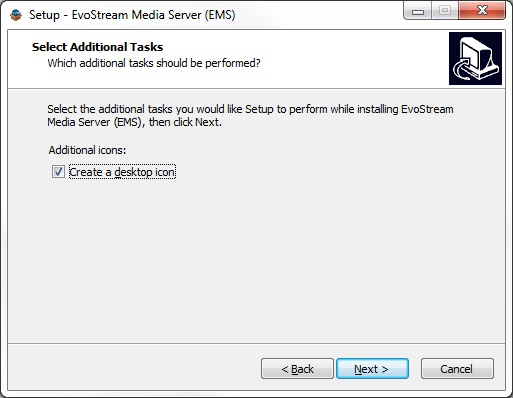
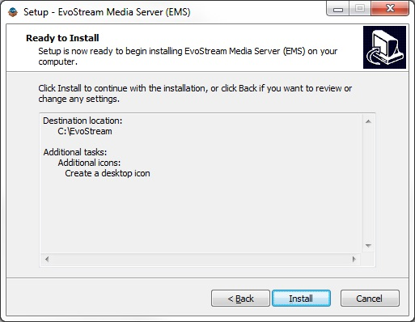
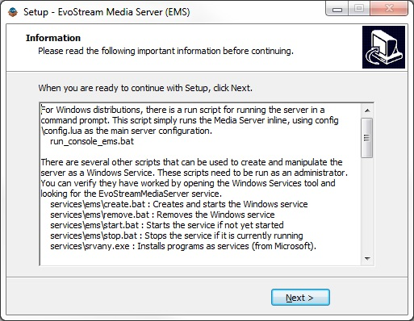
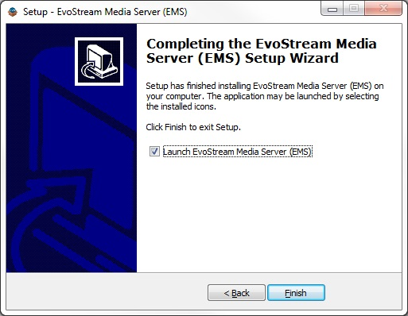

[TOC]

# Installation

## Obtaining a License

A license file is required to run EMS. EvoStream offers 30-day trial licenses which can be obtained from the EvoStream website: [https://evostream.com/free-trial/](https://evostream.com/free-trial/)

Licenses can be purchased from EvoStream directly, contact [sales@evostream.com](mailto:sales@evostream.com), or via the EvoStream Website: [https://evostream.com/pricing/](https://evostream.com/pricing/).


## Windows

1. Download the EMS package installer at [https://evostream.com/software-downloads](https://evostream.com/software-downloads)

2. Install EMS 

   2.1. Extract the zip package

   2.2. Right-click on `setup.exe` then click **Run as administrator**

   

   ​

   2.3. Select the Setup Language, click **OK**

   

   ​

   2.4. Click **Next** to continue the installation

   

   ​

   2.5 Read the license agreement and select **I accept the agreement**, click **Next**

   

   ​

   2.6. Verify the installation path, click **Next**

   

   ​

   2.7. Tick **Create a desktop icon**, click **Next**

   

   ​

   2.8. Confirm installation, click **Install**

   

   ​

   2.9. Read the information, click **Next**

   

   ​

   2.10. Click **Finish** to finish the installation.  

   

   ​

   **Note:** Uncheck **Launch EMS** if the license is not yet installed.


### License Installation

**Note:** You should already have your license file available. If none, EvoStream offers a **30-day free trial** license to those who want to explore the features of EMS. Click [here](https://evostream.com/free-trial/) to avail the free trial or contact [salesupport@evostream](mailto:salessupport@evostream.com) for other license type purchase.

To install the license, simply copy the `License.lic` file to `C:\EvoStream\config`.


### Distribution Content

```
C:\EvoStream
   ├── config
   │   ├── auth.xml
   │   ├── bandwidthlimits.xml
   │   ├── blacklist.txt
   │   ├── config.lua
   │   ├── connlimits.xml
   │   ├── ingestpoints.cml
   │   ├── pushPullSetup.xml
   │   ├── server.cert
   │   ├── server.key
   │   ├── users.lua
   │   ├── webconfig.lua
   │   └── whitelist.txt
   ├── demo
   │   ├── base64.js
   │   └── emsdemo.html
   ├── evo-avconv-presets
   │   └── [30 transcode preset files]
   ├── evo-phpengine
   ├── evo-webroot
       ├── demo
       │   ├── css
       │   ├── evo.png
       │   ├── evowrtcclient.html
       │   ├── evowsvideo.html
       │   ├── jsonMetaTest.html
       │   ├── jsonMetaWriteTest.html
       │   └── loading.gif
       ├── EMS_Web_UI
       │   ├── css
       │   ├── img
       │   ├── js
       │   ├── php
       │   ├── phpacct
       │   ├── settings
       │   ├── swf
       │   ├── evo.png
       │   ├── evostream_copyright.txt
       │   ├── index.php
       │   ├── install_license.php
       │   ├── license.txt
       │   ├── loading.gif
       │   ├── navbar.php
       │   ├── README.txt
       │   ├── README[Enable_Login_Authentication].txt
       │   └── style.css
       ├── evowebservices
       │   ├── config
       │   ├── core
       │   ├── plugins
       │   ├── evostream_copyright.txt
       │   ├── evowebservices.php   
       │   └── README.txt
       ├── clientaccesspolicy.xml
       └── crossdomain.xml
   ├── logs
   ├── media
   ├── services
   ├── emsTranscoder.bat
   ├── evo-avconv.exe
   ├── evo-mp4writer.exe
   ├── Evostream Media Server EULA v2.pdf
   ├── evostreamms.exe
   ├── evo-webserver.exe
   ├── libgcrypt-20.dll
   ├── libgmp-10.dll
   ├── libgnutls-28.dll
   ├── libgpg-error6-0.dll
   ├── libhogweed-2-5.dll
   ├── libiconv-2.dll
   ├── libmicrohttpd-12.dll
   ├── libnettle-4-7.dll
   ├── README.txt
   ├── run_console_ems.bat
   ├── tests.exe
   ├── unins000.dat
   ├── unins000.exe
   └── zlib1.dll
```


## Linux

### Platform Verification

If you are unsure if the distribution you downloaded is appropriate for your Operating System, you can use the `platformTests` program. This program is available with all distributions and provides a suite of platform compatibility tests. It can be found in the bin directory.

On all systems, open a console or terminal (command prompt) and run the `platformTests` executable (`./platformTests`). It will print out the results of the platform compatibility tests. If the test succeeds, then you have an appropriate distribution!


### Linux Limitations

Linux systems place limits on the number of sockets and file descriptors a process may use. This will apply to the EMS as well. If you plan on using more than 1024 connections at one time for your server, you will need to modify the following configuration file: `/etc/security/limits.conf`

The following lines will need to be added/modified:

```
soft nofile 16384
hard nofile 65536
soft nproc 4096
hard nproc 16384
```


### A. Linux Package (Linux apt/yum Installer)

**Pre-requisites:**

Administrative privileges are required. This can be accomplished in many ways.

If the sudo utility is available:

```
$ su –
```

If the sudo utility is not available:

```
$ sudo su –
```

**Note:**

The prompt changes from `$` to `#` when administrative privileges are enabled.


**Installation Procedure:**

1\. Retrieve the script used to install the EvoStream software repository and store it

- Debian based Linux distributions (Ubuntu or Debian)

  ```
  # wget http://apt.evostream.com/installkeys.sh -O /tmp/installkeys.sh
  ```

- RedHat based Linux distributions (CentOS, Fedora, RHEL)

  ```
  # curl http://yum.evostream.com/installkeys.sh -o /tmp/installkeys.sh
  ```

  ​

2\. Execute the script to install the EvoStream software repository and keys

```
# sh /tmp/installkeys.sh
```

- If successful, the following message should be printed on the console:

  ```
  "EvoStream keys installed successfully"
  ```

At this stage, the EvoStream software repository and keys are successfully installed and you can install packages from it.

**Note:** Steps 1 and 2 above must be executed only once.

The following steps are used to install the EvoStream Media Server, and can be repeated to update the EMS to the most recent release.


3\. Install EvoStream Media Server.

- Debian based Linux distributions (Ubuntu or Debian)

  ```
  # apt-get install evostream-mediaserver
  ```

- RedHat based Linux distributions (CentOS, Fedora, RHEL)

  ```
  # yum install evostream-mediaserver
  ```


#### License Installation

To install the license, simply copy the `License.lic` file to `/etc/evostream/License.lic`.


### B. Linux Archive (.tar.gz Distribution)

You can install the EMS from a simple archive file (.tar.gz). The latest EMS Release can be found on the EvoStream website: [https://evostream.com/software-downloads/](https://evostream.com/software-downloads/).

You will need to choose the most appropriate distribution for the Operating System that you are using. Once you have downloaded your distribution.

Simply **extract** the EMS package. The location of the installation is not important. However, for security reasons, the EvoStream Media Server should **NOT** be installed into the web-root of the target computer (if one exists).


#### License Installation

To install the license, simply copy the `License.lic` file to `../config/License.lic`.


### Distribution Content

#### A. Linux Package

**A.1. Configuration files**

```
├── etc
│   └── evostreamms
│       ├── blacklist.txt
│       ├── config.lua
│       ├── server.cert
│       ├── server.key
│       ├── users.lua
│       ├── webconfig.lua
│       └── whitelist.txt
```

**A. 2. XXX Files**

```
├── usr
│   ├── bin
│   │   ├── evo-phpengine
│   │   │   └── php.cgi
│   │   ├── evo-avconv
│   │   ├── evo-mp4writer
│   │   ├── evostreamms
│   │   └── evo-webserver
│   └── share
│       ├── evo-avconv
│       │   └── presets
│       │       └── [30 transcode preset files]
│       └── doc
│           └── evostreamms
│               ├── copyright
│               ├── EvoStream Media Server EULA v2.pdf
│               ├── README.txt
│               └── version
│                   ├── BUILD_DATE
│                   ├── BUILD_NUMBER
│                   ├── CODE_NAME
│                   ├── OS_NAME
│                   ├── OS_VERSION
│                   └── RELEASE_NUMBER
```

**A.3. XML Files**

```
└── var
    ├── evostreamms
    │   ├── media
    │   └── xml
    │       ├── auth.xml
    │       ├── bandwidthlimits.xml
    │       ├── connlimits.xml
    │       ├── ingestpoints.xml
    │       └── pushPullSetup.xml
```

**A.4. HTML and evowebservices Files**

```
└── var
    ├── evo-webroot
    │   ├── demo
    │   │   ├── css
    │   │   ├── evo.png
    │   │   ├── evowrtcclient.html
    │   │   ├── evowsvideo.html
    │   │   ├── jsonMetaTest.html
    │   │   ├── jsonMetaWriteTest.html
    │   │   └── loading.gif
    │   ├── evowebservices
    │   │   ├── config
    │   │   ├── core
    │   │   ├── plugins
    │   │   ├── evostream_copyright.txt
    │   │   ├── evowebservices.php
    │   │   └── README.txt
    │   ├── clientaccesspolicy.xml
    │   └── crossdomaim.xml
```

**A.5. Log Files**

```
└── var
    ├── log
    │   └── evostreamms
```

**A.6. Executable Files**

```
└── var
    └── run
        └── evostreamms
```


#### B. Linux Archive

```
./EvoStream Archive
  ├── bin
  │   ├── evo-phpengine
  │   ├── emsTranscoder.sh
  │   ├── evo-avconv
  │   ├── evo-mp4writer
  │   ├── evostreamms
  │   ├── evo-webserver
  │   ├── platformTests
  │   ├── run_console_ems.sh
  │   └── run_daemon_ems.sh
  ├── config
  │   ├── auth.xml
  │   ├── bandwidthlimits.xml
  │   ├── blacklist.txt
  │   ├── config.lua
  │   ├── connlimits.xml
  │   ├── ingestpoints.cml
  │   ├── pushPullSetup.xml
  │   ├── server.cert
  │   ├── server.key
  │   ├── users.lua
  │   ├── webconfig.lua
  │   └── whitelist.txt
  ├── demo
  │   ├── base64.js
  │   └── emsdemo.html
  ├── evo-avconv-presets
  │   └── [30 transcode preset files]
  ├── evo-webroot
      ├── demo
      │   ├── css
      │   ├── evo.png
      │   ├── evowrtcclient.html
      │   ├── evowsvideo.html
      │   ├── jsonMetaTest.html
      │   ├── jsonMetaWriteTest.html
      │   └── loading.gif
      ├── evowebservices
      │   ├── config
      │   ├── core
      │   ├── plugins
      │   ├── EMS_Web_Services_User_Guide.pdf
      │   ├── evostream_copyright.txt
      │   └── evowebservices.php
      ├── clientaccesspolicy.xml
      └── crossdomain.xml
  ├── logs
  ├── media
  ├── BUILD_DATE
  ├── Evostream Media Server EULA v2.pdf
  └── README.txt
```


## Other

### A. Mac OS X

You can install the EMS from a simple archive file (.tar.gz). The latest EMS Release can be found on the EvoStream website: [https://evostream.com/software-downloads/](https://evostream.com/software-downloads/).

You will need to choose the most appropriate distribution for the Operating System that you are using. Once you have downloaded your distribution.

Simply **extract** the EMS package. The location of the installation is not important. However, for security reasons, the EvoStream Media Server should **NOT** be installed into the web-root of the target computer (if one exists).

To install the license, simply copy the `License.lic` file to `../config/License.lic`.


### B. FreeBSD

You can install the EMS from a simple archive file (.tar.gz). The latest EMS Release can be found on the EvoStream website: [https://evostream.com/software-downloads/](https://evostream.com/software-downloads/).

You will need to choose the most appropriate distribution for the Operating System that you are using. Once you have downloaded your distribution.

Simply **extract** the EMS package. The location of the installation is not important. However, for security reasons, the EvoStream Media Server should **NOT** be installed into the web-root of the target computer (if one exists).

To install the license, simply copy the `License.lic` file to `../config/License.lic`.


### C. Windows Embedded

Contact Sales Support if you need a build for Windows Embedded. See [installation procedure on Windows](#Windows).


### D. Raspberry Pi

You can install the EMS from a simple archive file (.tar.gz). The latest EMS Release can be found on the EvoStream website: [https://evostream.com/software-downloads/](https://evostream.com/software-downloads/).

You will need to choose the most appropriate distribution for the Operating System that you are using. Once you have downloaded your distribution.

Simply **extract** the EMS package. The location of the installation is not important. However, for security reasons, the EvoStream Media Server should **NOT** be installed into the web-root of the target computer (if one exists).

To install the license, simply copy the `License.lic` file to `../config/License.lic`.


### E. Android

Contact Sales Support if you need a build for Android.


### F. iOS

Contact Sales Support if you need a build for iOS.


## File Descriptions

### Command Files

| File                | Description                              |
| ------------------- | ---------------------------------------- |
| evostreamms(.exe)   | The EvoStream binary itself              |
| evo-webserver(.exe) | The EvoStream Web Server (EWS) binary. This handles the serving of all files over HTTP |
| evo-mp4writer(.exe) | This binary application combines the various pieces of each MP4 recording once the file is ready to be finalized |
| evo-avconv(.exe)    | The EvoStream Transcoder binary. This gets called in reaction to the `transcode` API command |
| run_daemon_ems.sh   | Shell script used on **Linux/Unix** environments to start the EMS as a background application. Use this for production deployments. It requires that the user “evostream” exists, the script will not work without it. Please feel free to modify this script to use a different user. When using the daemon script, to validate that the server is running, you can issue the command `ps –ef` |
| run_console_ems.bat | Batch file/script on **Windows** which runs the EMS as a console application. This is useful for new users as it provides instant feedback on the console when commands are entered and shows errors if they occur in new streams. |
| create.bat          | Script to create a **Windows** service for the EMS. This will also start the EMS as a background process. This must be run with Administrative privileges as it writes to the Windows Registry. *This only needs to be run once.* |
| remove.bat          | Script to remove the **Windows** service for the EMS and remove the relevant Windows Registry entries. This must be run with Administrative privileges. |
| start.bat           | Script to start the EMS **Windows** service. This script will not work if create.bat has not been run first. |
| stop.bat            | Script to stop the EMS **Windows** Service. |
| Srvany.exe          | This is a binary provided by Microsoft and is used to create the Windows Service. |


### Configuration Files

| File                | Description                              |
| ------------------- | ---------------------------------------- |
| config.lua          | The main configuration file used by the EMS. The contents of this file are detailed later in this document. |
| webconfig.lua       | The EvoStream Web Server (EWS) configuration file. The contents of this file are detailed later in this document. |
| users.lua           | Defines the valid authentication the server will require when streams are pushed into the EMS. |
| pushPullSetup.xml   | This file is used by the EMS to store stream action commands that are made through the Runtime API. This file may not be modified. At startup, if the EMS detects that the file has been modified it will rename the file and start with a blank/fresh copy. |
| connlimits.xml      | Defines the maximum number of concurrent connections you want the EMS to accept |
| bandwidthlimits.xml | Defines the maximum amount of bandwidth you want the server to be able to use (set the instantaneous bandwidth cap). |


### Documentation

| File                               | Description                              |
| ---------------------------------- | ---------------------------------------- |
| EvoStream Media Server EULA v2.pdf | The End User License Agreement for the EMS |


### Miscellaneous

| File                            | Description                              |
| ------------------------------- | ---------------------------------------- |
| demo/emsdemo.htmldemo/base64.js | The emsdemo.html file can be opened directly in a web browser and provides some example commands which can be sent to the EMS. |
| media/                          | The media directory is the default location for video-on-demand files. This is where the EMS will look when VOD requests are made. This default location can be changed in the EMS main configuration file, which is typically `config/config.lua` |
| logs/                           | This is the directory that EMS will write its logs to. This default location can be changed in the EMS main configuration file, which is typically `config/config.lua` |
| License.lic                     | This is the license file required to run the EMS. It can be placed in the `config/` , `bin/` , or `/etc/evostreamms/` folders, or in whatever folder the evostreamms binary resides. |
| evowebservices.log              | This is an auto-generated file which contains the logs for the evowebservices. The file will be placed in `../evo-webroot/evowebservices`. |


# Starting EvoStream Media Server

## Linux Distributions (Linux apt/yum Installer)

Running EMS as a service:

```
# service evostreamms start
or
# service evostreamms start_console
```

**What's the difference?** If you run EMS using `start_console`, it will show logs on the console where you run the EMS. Starting it with `start`  will not show logs in the console. 

You can also do restart by sending: 

```
# service evostreamms restart
```


## Linux, Mac OSX and BSD Distributions (.tar.gz Distribution)

There are two “run” scripts that can be used to start the EvoStream Media Server, just locate the `./bin` folder of EMS and execute the command:

1. Run EMS with console logs, using `./config/config.lua` as the main server configuration. 

   ```
    $ ./run_console_ems.sh
   ```

2. Run EMS as a background process. The script will attempt to assign the run-process to the user `evostream`.

   ```
    $ ./run_daemon_ems.sh

   ```

**Notes:**

- Either command can be directly executed.
- For `run_daemon_ems.sh`, if the `evostream` user does not exist, an error will be printed to the screen. Despite the error, the EMS will probably have been started. To check if the server is running, user can issue `ps –ef | grep evostream` in terminal.

This command will print differently on different operating systems, but it should let you know that the server is running.

- The **user** used by `run_daemon_ems.sh` can easily be modified by changing the value after the `-u` in the script itself.
- The user running the EvoStream Media Server must have sufficient permission to open and bind to network ports.


## Windows Distribution

The EMS may be started using the **Windows Services** tool in Windows.

### Via Service

**Pre-requisite:**

It is needed to add EMS into your Window's registry to enable the use of service.

1. Open a command prompt

2. Locate the services folder: `C:\EvoStream\services\ems`

3. Send command: `create.bat`

   ```
   C:\EvoStream\services\ems> create.bat
   ```

4. A confirmation will be asked, click **Yes**


5. EMS keys are now registered! Click **OK**


6. Verify the registration by checking in `Control Panel > Administrative  Tools > Services`

   

**Note:** Use the `remove.bat` command if you opt to remove EMS in the registry.


**Starting the Service**

1. Open a command prompt

2. Locate the services folder: `C:\EvoStream\services\ems`

3. Send command: `start.bat`

   This will start the service if it has not already been started


- `C:\EvoStream\services\ems\stop.bat` : Stops the service if it is currently running


### Via Shotcut Icon

User may directly run the EMS using the shortcut icon if added during installation

 

This will open a console running EMS.

The shotcut icon calls the `run_console_ems.bat`. You may also run this executable found in the installed EMS. Simply double-clicked to start the server. This script simply runs the Media Server through the command prompt, using `config/config.lua` as the main server configuration. 

```
C:\EvoStream\run_console_ems.bat
```


### Startup Success

For either Windows or Linux/BSD/OSX, when you run the EMS as a console application, you should see the following screen indicating the server is up and running:


**Tip!** A successful EMS start will show GO! GO! GO! in console.


### EMS Command Line Definition

The evostreamms executable can be run with a few different options. The command line signature is as follows:

**Format:** evostreamms [OPTIONS][config_file_path]

| Command                        | Function                                 |
| ------------------------------ | ---------------------------------------- |
| –help                          | Prints this help and exit.               |
| –version                       | Prints the version and exit.             |
| –use-implicit-console-appender | Adds extra logging at runtime, but is only effective when the server is started as a console application. This is particularly useful when the server starts and stops immediately for an unknown reason. It will allow you users to see if something is wrong, particularly with the config file. |
| –daemon                        | Overrides the daemon setting inside the config file and forces the server to start in daemon mode. |
| –uid=                          | Run the process with the specified user id. |
| –gid=                          | Run the process with the specified group id. |
| –pid=<pid_file>                | Create PID file. Works only if –daemon option is specified. |