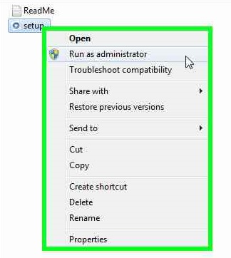
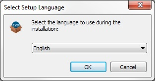
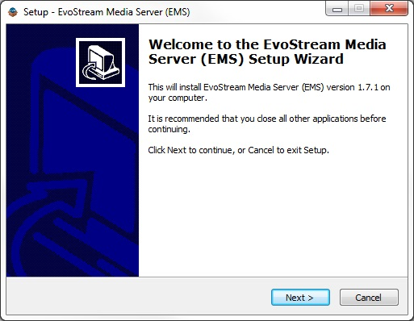
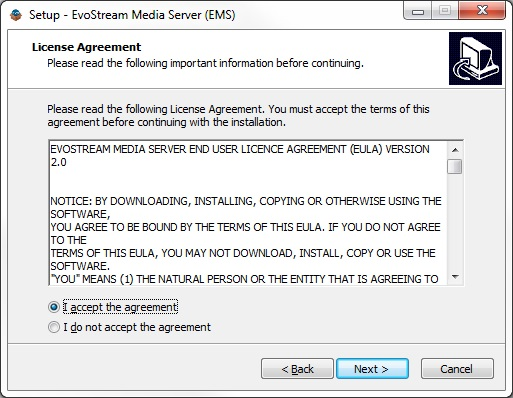
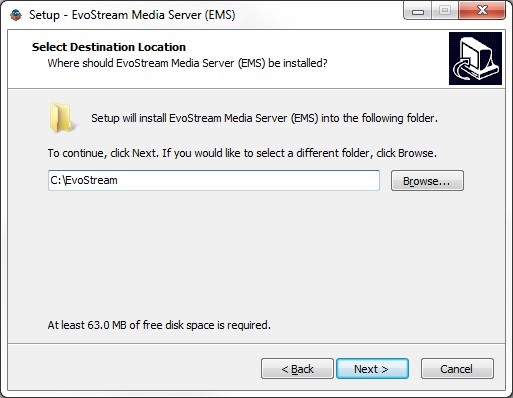

# Installation

## Windows

1. Download the EMS package installer at [https://evostream.com/software-downloads](https://evostream.com/software-downloads)

2. Install EMS 

   2.1. Extract the zip package

   2.2. Right-click on `setup.exe` then click **Run as administrator**

   

   ​

   2.3. Select the Setup Language, click **OK**

   

   ​

   2.4. Click **Next** to continue the installation

   

   ​

   2.5 Read the license agreement and select **I accept the agreement**, click **Next**

   

   ​

   2.6. Verify the installation path, click **Next**

   

   ​

   2.7. Tick **Create a desktop icon**, click **Next**

   

   ​

   2.8. Confirm installation, click **Install**

   

   ​

   2.9. Read the information, click **Next**

   

   ​

   2.10. Click **Finish** to finish the installation.  

   

   ​

   **Note:** Uncheck **Launch EMS** if the license is not yet installed.


## License Installation

**Note:** You should already have your license file available. If none, EvoStream offers a **30-day free trial** license to those who want to explore the features of EMS. Click [here](https://evostream.com/free-trial/) to avail the free trial or contact [salesupport@evostream](mailto:salessupport@evostream.com) for other license type purchase.

To install the license, simply copy the `License.lic` file to `C:\EvoStream\config`.


## Distribution Content

```
C:\EvoStream
   ├── config
   │   ├── auth.xml
   │   ├── bandwidthlimits.xml
   │   ├── blacklist.txt
   │   ├── config.lua
   │   ├── connlimits.xml
   │   ├── ingestpoints.cml
   │   ├── pushPullSetup.xml
   │   ├── server.cert
   │   ├── server.key
   │   ├── users.lua
   │   ├── webconfig.lua
   │   └── whitelist.txt
   ├── demo
   │   ├── base64.js
   │   └── emsdemo.html
   ├── evo-avconv-presets
   │   └── [30 transcode preset files]
   ├── evo-phpengine
   ├── evo-webroot
       ├── demo
       │   ├── css
       │   ├── evo.png
       │   ├── evowrtcclient.html
       │   ├── evowsvideo.html
       │   ├── jsonMetaTest.html
       │   ├── jsonMetaWriteTest.html
       │   └── loading.gif
       ├── EMS_Web_UI
       │   ├── css
       │   ├── img
       │   ├── js
       │   ├── php
       │   ├── phpacct
       │   ├── settings
       │   ├── swf
       │   ├── evo.png
       │   ├── evostream_copyright.txt
       │   ├── index.php
       │   ├── install_license.php
       │   ├── license.txt
       │   ├── loading.gif
       │   ├── navbar.php
       │   ├── README.txt
       │   ├── README[Enable_Login_Authentication].txt
       │   └── style.css
       ├── evowebservices
       │   ├── config
       │   ├── core
       │   ├── plugins
       │   ├── evostream_copyright.txt
       │   ├── evowebservices.php   
       │   └── README.txt
       ├── clientaccesspolicy.xml
       └── crossdomain.xml
   ├── logs
   ├── media
   ├── services
   ├── emsTranscoder.bat
   ├── evo-avconv.exe
   ├── evo-mp4writer.exe
   ├── Evostream Media Server EULA v2.pdf
   ├── evostreamms.exe
   ├── evo-webserver.exe
   ├── libgcrypt-20.dll
   ├── libgmp-10.dll
   ├── libgnutls-28.dll
   ├── libgpg-error6-0.dll
   ├── libhogweed-2-5.dll
   ├── libiconv-2.dll
   ├── libmicrohttpd-12.dll
   ├── libnettle-4-7.dll
   ├── README.txt
   ├── run_console_ems.bat
   ├── tests.exe
   ├── unins000.dat
   ├── unins000.exe
   └── zlib1.dll
```


## Linux

### A. Linux Package

**Pre-requisites:**

Administrative privileges are required. This can be accomplished in many ways.

If the sudo utility is available:

```
$ su –
```

If the sudo utility is not available:

```
$ sudo su –
```

**Note:**

The prompt changes from `$` to `#` when administrative privileges are enabled.


#### Installation Procedure:

1\. Retrieve the script used to install the EvoStream software repository and store it

- Debian based Linux distributions (Ubuntu or Debian)

  ```
  # wget http://apt.evostream.com/installkeys.sh -O /tmp/installkeys.sh
  ```

- RedHat based Linux distributions (CentOS, Fedora, RHEL)

  ```
  # curl http://yum.evostream.com/installkeys.sh -o /tmp/installkeys.sh
  ```

  ​

2\. Execute the script to install the EvoStream software repository and keys

```
# sh /tmp/installkeys.sh
```

- If successful, the following message should be printed on the console:

  ```
  "EvoStream keys installed successfully"
  ```

At this stage, the EvoStream software repository and keys are successfully installed and you can install packages from it.

**Note:** Steps 1 and 2 above must be executed only once.

The following steps are used to install the EvoStream Media Server, and can be repeated to update the EMS to the most recent release.


3\. Install EvoStream Media Server.

- Debian based Linux distributions (Ubuntu or Debian)

  ```
  # apt-get install evostream-mediaserver
  ```

- RedHat based Linux distributions (CentOS, Fedora, RHEL)

  ```
  # yum install evostream-mediaserver
  ```


### B. Linux Archive

You can install the EMS from a simple archive file (.tar.gz). The latest EMS Release can be found on the EvoStream website: [https://evostream.com/software-downloads/](https://evostream.com/software-downloads/).

You will need to choose the most appropriate distribution for the Operating System that you are using. Once you have downloaded your distribution.

Simply **extract** the EMS package. The location of the installation is not important. However, for security reasons, the EvoStream Media Server should **NOT** be installed into the web-root of the target computer (if one exists).


### License Installation

**Note:** You should already have your license file available. If none, EvoStream offers a **30-day free trial** license to those who want to explore the features of EMS. Click [here](https://evostream.com/free-trial/) to avail the free trial or contact [salesupport@evostream](mailto:salessupport@evostream.com) for other license type purchase.

To install the license, simply copy the `License.lic` file to `/etc/evostream/License.lic` for Linux package or  `../config/License.lic` for Linux Archive.


## Distribution Content

### A. Linux Package

**A.1. Configuration files**

```
├── etc
│   └── evostreamms
│       ├── blacklist.txt
│       ├── config.lua
│       ├── server.cert
│       ├── server.key
│       ├── users.lua
│       ├── webconfig.lua
│       └── whitelist.txt
```

**A. 2. XXX Files**

```
├── usr
│   ├── bin
│   │   ├── evo-phpengine
│   │   │   └── php.cgi
│   │   ├── evo-avconv
│   │   ├── evo-mp4writer
│   │   ├── evostreamms
│   │   └── evo-webserver
│   └── share
│       ├── evo-avconv
│       │   └── presets
│       │       └── [30 transcode preset files]
│       └── doc
│           └── evostreamms
│               ├── copyright
│               ├── EvoStream Media Server EULA v2.pdf
│               ├── README.txt
│               └── version
│                   ├── BUILD_DATE
│                   ├── BUILD_NUMBER
│                   ├── CODE_NAME
│                   ├── OS_NAME
│                   ├── OS_VERSION
│                   └── RELEASE_NUMBER
```

**A.3. XML Files**

```
└── var
    ├── evostreamms
    │   ├── media
    │   └── xml
    │       ├── auth.xml
    │       ├── bandwidthlimits.xml
    │       ├── connlimits.xml
    │       ├── ingestpoints.xml
    │       └── pushPullSetup.xml
```

**A.4. HTML and evowebservices Files**

```
└── var
    ├── evo-webroot
    │   ├── demo
    │   │   ├── css
    │   │   ├── evo.png
    │   │   ├── evowrtcclient.html
    │   │   ├── evowsvideo.html
    │   │   ├── jsonMetaTest.html
    │   │   ├── jsonMetaWriteTest.html
    │   │   └── loading.gif
    │   ├── evowebservices
    │   │   ├── config
    │   │   ├── core
    │   │   ├── plugins
    │   │   ├── evostream_copyright.txt
    │   │   ├── evowebservices.php
    │   │   └── README.txt
    │   ├── clientaccesspolicy.xml
    │   └── crossdomaim.xml
```

**A.5. Log Files**

```
└── var
    ├── log
    │   └── evostreamms
```

**A.6. Executable Files**

```
└── var
    └── run
        └── evostreamms
```


### B. Linux Archive

```
./EvoStream Archive
  ├── bin
  │   ├── evo-phpengine
  │   ├── emsTranscoder.sh
  │   ├── evo-avconv
  │   ├── evo-mp4writer
  │   ├── evostreamms
  │   ├── evo-webserver
  │   ├── platformTests
  │   ├── run_console_ems.sh
  │   └── run_daemon_ems.sh
  ├── config
  │   ├── auth.xml
  │   ├── bandwidthlimits.xml
  │   ├── blacklist.txt
  │   ├── config.lua
  │   ├── connlimits.xml
  │   ├── ingestpoints.cml
  │   ├── pushPullSetup.xml
  │   ├── server.cert
  │   ├── server.key
  │   ├── users.lua
  │   ├── webconfig.lua
  │   └── whitelist.txt
  ├── demo
  │   ├── base64.js
  │   └── emsdemo.html
  ├── evo-avconv-presets
  │   └── [30 transcode preset files]
  ├── evo-webroot
      ├── demo
      │   ├── css
      │   ├── evo.png
      │   ├── evowrtcclient.html
      │   ├── evowsvideo.html
      │   ├── jsonMetaTest.html
      │   ├── jsonMetaWriteTest.html
      │   └── loading.gif
      ├── evowebservices
      │   ├── config
      │   ├── core
      │   ├── plugins
      │   ├── EMS_Web_Services_User_Guide.pdf
      │   ├── evostream_copyright.txt
      │   └── evowebservices.php
      ├── clientaccesspolicy.xml
      └── crossdomain.xml
  ├── logs
  ├── media
  ├── BUILD_DATE
  ├── Evostream Media Server EULA v2.pdf
  └── README.txt
```


## Other

### A. Mac OS X

You can install the EMS from a simple archive file (.tar.gz). The latest EMS Release can be found on the EvoStream website: [https://evostream.com/software-downloads/](https://evostream.com/software-downloads/).

You will need to choose the most appropriate distribution for the Operating System that you are using. Once you have downloaded your distribution.

Simply **extract** the EMS package. The location of the installation is not important. However, for security reasons, the EvoStream Media Server should **NOT** be installed into the web-root of the target computer (if one exists).


#### License Installation

To install the license, simply copy the `License.lic` file to `../config/License.lic`.


### B. FreeBSD

You can install the EMS from a simple archive file (.tar.gz). The latest EMS Release can be found on the EvoStream website: [https://evostream.com/software-downloads/](https://evostream.com/software-downloads/).

You will need to choose the most appropriate distribution for the Operating System that you are using. Once you have downloaded your distribution.

Simply **extract** the EMS package. The location of the installation is not important. However, for security reasons, the EvoStream Media Server should **NOT** be installed into the web-root of the target computer (if one exists).


#### License Installation

To install the license, simply copy the `License.lic` file to `../config/License.lic`.


### C. Windows Embedded

Contact Sales Support if you need a build for Windows Embedded. See [installation procedure on Windows](#Windows).


### D. Raspberry Pi

You can install the EMS from a simple archive file (.tar.gz). The latest EMS Release can be found on the EvoStream website: [https://evostream.com/software-downloads/](https://evostream.com/software-downloads/).

You will need to choose the most appropriate distribution for the Operating System that you are using. Once you have downloaded your distribution.

Simply **extract** the EMS package. The location of the installation is not important. However, for security reasons, the EvoStream Media Server should **NOT** be installed into the web-root of the target computer (if one exists).


#### License Installation

To install the license, simply copy the `License.lic` file to `../config/License.lic`.


### E. Android

Contact Sales Support if you need a build for Android.


### F. iOS

Contact Sales Support if you need a build for iOS.

