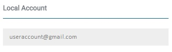
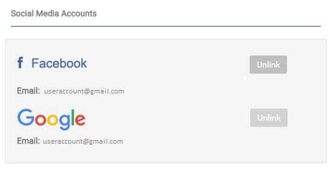
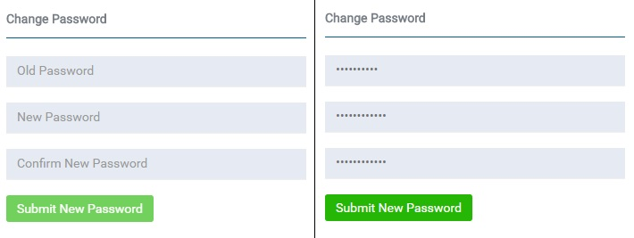

# Profile

This page is where you can edit or update your profile.

## Local Account

Displays user's local email account used.

## Social Media Accounts

If you logged in using your social media account, this will be seen under the Social Media Accounts in your profile. 

**Unlink:** This will remove/logout your account in the EMS Web UI

## Change Password

This portion lets users to change password being used.

To change password enter the Old, New Password and Confirm New Password and click **Submit New Password**

