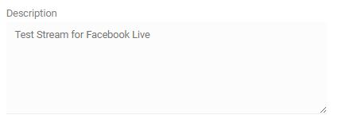
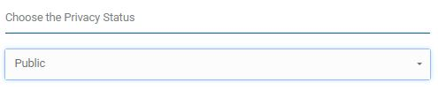
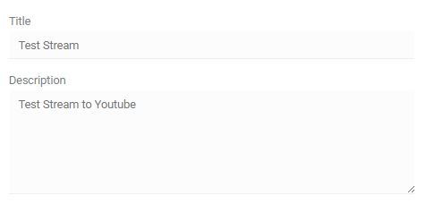
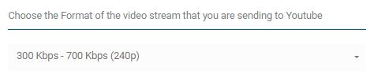
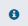
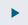
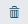
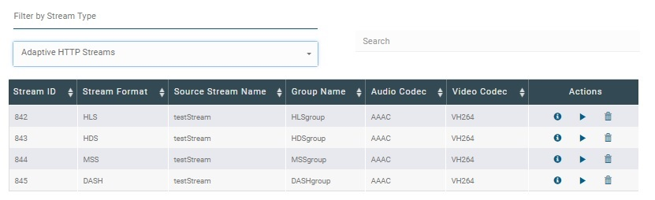
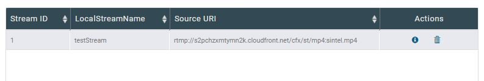
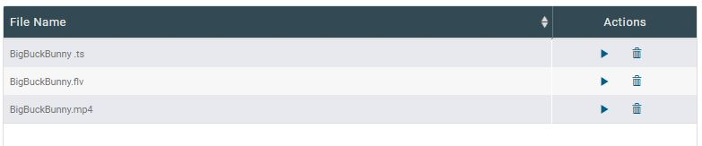

# Streams

The Streams page consists of different functionalities that can be done with your streams. From Add to Create HTTP Streams to Send Streams to Facebook Live and YouTube Live and to do some configurations.

## Add

This is where you can add a stream to your EMS. You can add simple streams and HTTP streams in this page.

### Adding Inbound Live Streams

If you wan't to add a RTSP or RTMP stream, simply do the following:

1. Choose  **Inbound Live Stream** under Choose the Stream Type to Add
2. Enter the **URI Stream Source**
3. Enter the **Local Stream Name**
4. Click **Add Stream**

**Notes:**

- - will clear inputs in fields

-  - redirects to Active to view the stream in list

See [pullStream]() API for more information.

### Adding HTTP Streams

Adding HTTP streams has made easy in this page. You can now create your HLS, DASH, HDS and MSS here.

1. Choose the Stream Type ( HLS, DASH, HDS, MSS)

2. Choose the Stream Source

   **Note:** List of Active streams will be shown under the Stream Source field. You can select more than one

3. Enter Target Folder

   **Note:** Should use absolute path 

4. Enter **Group Name**

5. Enter **Chunk Length**

6. Click **Add Stream**

**Notes:**

-  - will clear inputs in fields
-  - redirects to Active to view the stream in list

------

## Send

------

## Facebook Live

This will try to push a local stream to Facebook Live using port  80. Below are the steps on how to push a stream to Facebook:

1. **Log in** to your Facebook account if not yet logged in

2. **Select a stream** to push to Facebook. Note that a list active streams will be listed under the selections

   

3. **Enter a description** for the stream to be pushed

   

4. **Choose where to publish** the live stream. You have several options where to publish the stream:

   - User Timeline: publishes the stream to the user's timeline

   - Page: publishes the stream to the selected page you manage

   - Event: publishes the stream to the selected  event you manage

   - Group: publishes the stream to the selected  group you manage

     **Notes**: 

     - If you have multiple pages, events or groups, a list of pages, events or groups will display under the selected category
     - You can only select one page, event and group
     - You can only publish on the pages, events, groups you manage 

     ​

   

   ​

5. **Select the privacy setting** for the stream

   

   See Facebook's privacy settings [here](https://www.facebook.com/help/325807937506242/).

   ​

6. **Click Send Stream to Facebook Video** to publish the stream

   

   **Note:** In this example, a stream named **testStream** will be pushed in **Group A** page which will be seen by **Public**.

   ​

7. **Check the page** where the stream is pushed

   

------

## YouTube Live

This will try to push a local stream to YouTube Live Stream using Events. Below are the steps on how to push a stream to YouTube:

**Note:** The pushed stream can only use the RTMP

1. **Log in** to your Google+ account if not yet logged in

2. **Select a stream** to push to Facebook. Note that a list active streams will be listed under the selections

   

3. **Enter a Title and Description** for the stream to be pushed

   

4. **Select the privacy setting** for the stream

   - **Public** - videos and playlists can be seen by and shared with anyone
   - **Private ** - videos and playlists can only be seen by you and the users you choose
   - **Unlisted** -  videos and playlists can be seen and shared by anyone with the link

   

   See YouTube's privacy settings [here](https://support.google.com/youtube/answer/157177?co=GENIE.Platform%3DDesktop&hl=en).

   ​

5. **Choose the stream format** of the stream

   

   **Note:** The video format should be the same or lesser than the stream format or else the stream published will fail to play

   ​

6. **Click Send Stream to YouTube** to publish the stream

   

   **Note:** In this example, a stream named **testStream** will be pushed to YouTube which will be viewed by **Publicly**.

   ​

7. **Check your YouTube channel** where the stream is pushed

------

## Active

Provides a detailed description of all active streams. 

**Note:** Refresh page to update the list

### Inbound Live Stream

Displays the list of all active pulled streams

- **Information** - displays the stream information in a new window
- **Play** - streams the inbound file
- **Delete** - deletes the stream in the configuration

### Outbound Streams

Displays the list of outbound streams

- **Information** - displays the stream information in a new window
- **Delete** - deletes the stream in the configuration

### Adaptive HTTP Streams

Displays the list of active HTTP streams

- **Information** - displays the stream information in a new window
- **Play** - streams the HTTP file
- **Delete** - deletes the stream in the configuration

### File Media

Displays the list active VOD streams

- **Information** - displays the stream information in a new window
- **Play** - streams the VOD file

------

## Config

This page lists all the push/pull configurations in EMS. There we're several configurations listed in this page: 

- pull - list of pulled streams in EMS
- push - list of pushed streams from EMS
- hls - list of HLS streams in EMS
- dash - list of DASH streams in EMS
- hds - list of HDS streams in EMS
- mss - list of MSS streams in EMS
- record - list of record streams in EMS
- process - list of processes in EMS

1. Choose the **configuration type** to filter

   

   ​

2. A list of stream type will display, select the **Action** you want to perform

   

   ​

   - **Information** - displays the stream information in a window
   - **Delete** - deletes the stream in the configuration

   ​

   ​

### Information

Displays the basic information and status of the stream. It also allows you to play or delete the stream.

**Play**:  plays the stream in a new window

**Delete** - deletes the stream in the configuration

**Basic Information**: displays the information of the stream 

**Stream Status**: displays the connection status of the stream

- Current:
- Previous:

------

## VOD

The VOD page is where you can access your streams in your EMS media folder. You can **play** or **delete** your VOD files here.

1. Enter the server's media folder directory

   

   **Note:** Should use absolute path

   ​

2. Click on **Load the Files** to show files in the media folder

   

3. Select the **Action** you want to perform

   

   - **Play** - streams the VOD file from the media folder
   - **Delete** - deletes the VOD file in the media folder